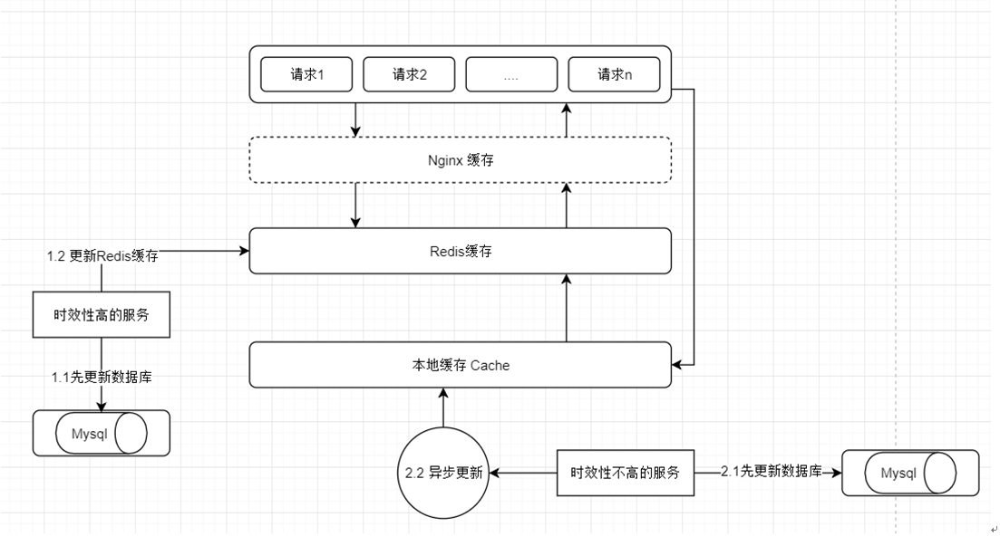
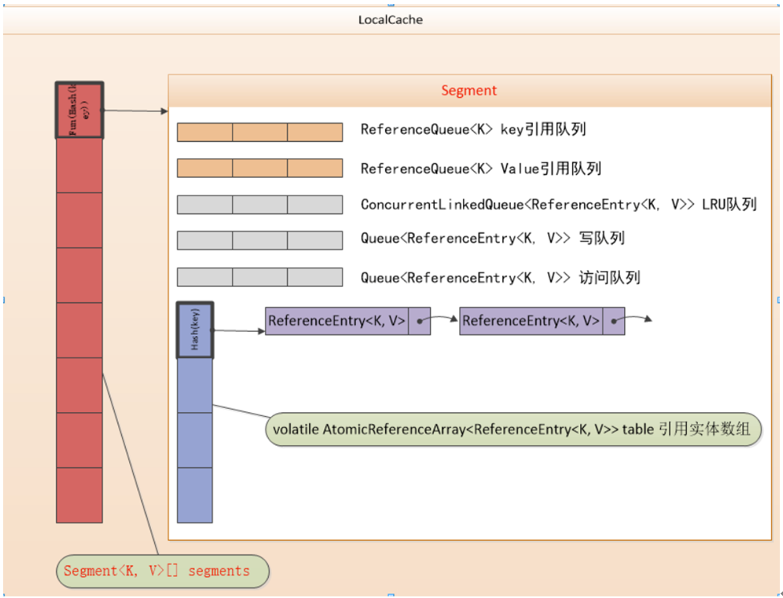

# SpringBoot 集成 Guava Cache

# 1. 什么是Google Guava Cache?

Google Guava Cache 就是一个 带自动回收功能 的CurrentHashMap,限制内存的占用，是一种非常优秀的本地缓存方案，提供了容量，时间和引用的缓存回收方式。基于容量的方式内部实现采用LRU算法，基于引用回收很好的利用了Java虚拟机的垃圾回收机制。

# 2. 为什么要使用本地缓存(Guava Cache)

* Nginx本地缓存：用于抗一些热数据的高并发访问，内存有限。

* Reids分布式缓存：用于抗一些很高的离散访问，支撑不那么热的数据的访问，支撑海量的数据，高并发的访问，高可用的服务。

* 本地缓存Cache：容量有限，只保存在当前实例中，无法共享，服务重启之后，数据会丢失，相对Redis缓存和Mysql，速度最快，一方面：主要缓存一些数据量不大，访问 频繁的数据，用于减少对Redis的访问，减少带宽消耗。另一方面：当Redis出现大规模灾难时，使用本地缓存 Cache 可以抗一下，不至于直接访问数据库，降低宕机的风险。

# 3. guava cache 原理

LocalCache类似ConcurrentHashMap采用了**分段策略**，通过减小锁的粒度来提高并发，LocalCache中数据存储在Segment[]中，每个segment又包含5个队列和一个table,这个table是自定义的一种类数组的结构，每个元素都包含一个ReferenceEntry<k,v>链表，指向next entry。

这些队列，前2个是key、value引用队列用以加速GC回收，后3个队列记录用户的写记录、访问记录、高频访问顺序队列用以实现LRU算法。

**对于get(key, loader)方法流程：**
* 对key做hash，找到存储的segment及数组table上的位置；
* 链表上查找entry，如果entry不为空，且value没有过期，则返回value，并刷新entry。
* 若链表上找不到entry，或者value已经过期，则调用lockedGetOrLoad。
    * 锁住整个segment，遍历entry可能在的链表，查看数据是否存在是否过期，若存在则返回。若过期则删除（table，各种queue）。若不存在，则新建一个entry插入table。放开整个segment的锁。
    * 锁住entry，调用loader的reload方法，从数据源加载数据，然后调用storeLoadedValue更新缓存。
    * storeLoadedValue时，锁住整个segment，将value设置到entry中，并设置相关数据（入写入/访问队列，加载/命中数据等）。

**put(key,value)方法：**

* 对key做hash，找到segment的位置和table上的位置；
* 锁住整个segment，将数据插入链表，更新统计数据。

